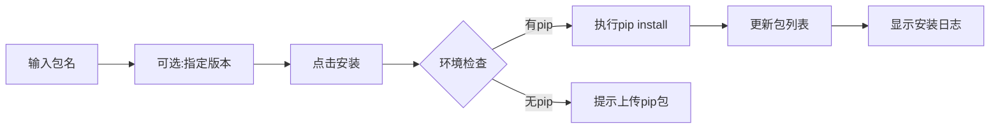
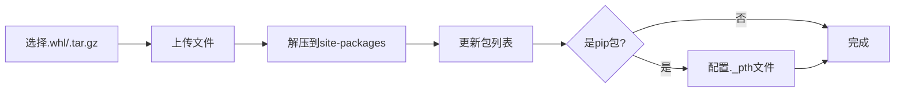

# Python 环境管理 - 设计与使用说明

## 📋 目录

1. [系统概述](#系统概述)
2. [核心功能](#核心功能)
3. [架构设计](#架构设计)
4. [使用场景](#使用场景)
5. [快速开始](#快速开始)
6. [详细功能说明](#详细功能说明)
7. [最佳实践](#最佳实践)
8. [常见问题](#常见问题)

---

## 系统概述

Python 环境管理系统是 BlockFlow 的核心组件，用于管理多个独立的 Python 运行环境，支持在线/离线包管理，为块（Block）的执行提供隔离的依赖环境。

### 核心特性

- ✅ **多环境管理**：支持创建和管理多个独立的 Python 环境
- ✅ **在线安装**：支持通过 pip 在线安装 Python 包
- ✅ **离线安装**：支持上传 `.whl` 和 `.tar.gz` 格式的离线包
- ✅ **运行时管理**：支持上传完整的 Python 运行时（适用于离线环境）
- ✅ **自动检测**：自动检测 Python 解释器路径和版本
- ✅ **依赖追踪**：记录包的安装方式、版本和来源
- ✅ **智能提示**：块测试失败时自动提示缺失依赖并快速跳转

---

## 核心功能

### 1. 环境管理

```
┌─────────────────────────────────────────┐
│  Python 环境列表                         │
├─────────────────────────────────────────┤
│  • 创建新环境                            │
│  • 编辑环境配置                          │
│  • 删除环境                              │
│  • 设置默认环境                          │
│  • 导出 requirements.txt                │
└─────────────────────────────────────────┘
```

### 2. 运行时配置

```
┌─────────────────────────────────────────┐
│  Python 运行时配置方式                   │
├─────────────────────────────────────────┤
│  方式1: 手动配置路径                     │
│         └─ 指定系统已安装的 Python      │
│                                          │
│  方式2: 上传运行时包                     │
│         └─ 上传 .zip/.tar.gz 压缩包     │
│         └─ 自动解压和检测               │
│                                          │
│  方式3: 稍后配置                         │
│         └─ 创建后再配置                 │
└─────────────────────────────────────────┘
```

### 3. 包管理

```
┌─────────────────────────────────────────┐
│  包安装方式                              │
├─────────────────────────────────────────┤
│  在线安装（需要 pip）                    │
│  ├─ 从 PyPI 安装                        │
│  ├─ 指定版本                            │
│  └─ 自动解析依赖                        │
│                                          │
│  离线安装（无需 pip）                    │
│  ├─ 上传 .whl 文件                      │
│  ├─ 上传 .tar.gz 文件                   │
│  └─ 直接解压到 site-packages           │
└─────────────────────────────────────────┘
```

---

## 架构设计

### 1. 数据模型

```java
PythonEnvironment {
    Long id;                           // 环境ID
    String name;                       // 环境名称
    String pythonVersion;              // Python版本（如：3.9.7）
    String description;                // 描述
    String pythonExecutable;           // Python解释器路径
    String sitePackagesPath;           // site-packages路径
    String envRootPath;                // 环境根目录
    Boolean isDefault;                 // 是否为默认环境
    Map<String, Object> packages;      // 已安装的包
    Date createTime;                   // 创建时间
}
```

### 2. 包信息结构

```json
{
  "packages": {
    "requests": {
      "version": "2.28.0",
      "installMethod": "pip",              // pip | offline
      "installedAt": "2025-01-21T10:30:00",
      "installedFrom": null
    },
    "numpy": {
      "version": "1.24.0",
      "installMethod": "offline",
      "installedAt": "2025-01-21T11:00:00",
      "installedFrom": "numpy-1.24.0-cp39-win_amd64.whl"
    }
  }
}
```

### 3. 目录结构

```
block-flow/
├── python-envs/              # Python 环境根目录
│   ├── env-1/               # 环境1
│   │   ├── python/          # Python 运行时
│   │   │   ├── python.exe   # Python 解释器
│   │   │   ├── Lib/
│   │   │   │   └── site-packages/  # 已安装的包
│   │   │   └── Scripts/
│   │   │       └── pip.exe  # pip 工具
│   │   └── uploaded/        # 上传的离线包
│   │       ├── requests-2.28.0.whl
│   │       └── numpy-1.24.0.whl
│   ├── env-2/               # 环境2
│   └── env-3/               # 环境3
└── blocks/                   # 块脚本目录
```

---

## 使用场景

### 场景1：在线环境 - 使用系统 Python

**适用情况**：服务器已安装 Python 且可以访问互联网

```
步骤：
1. 创建环境 → 选择"手动配置路径"
2. 输入 Python 路径：/usr/bin/python3
3. 保存环境
4. 进入"管理包" → 在线安装依赖
```

**优点**：
- ✅ 配置简单
- ✅ 可以使用 pip 在线安装
- ✅ 自动解析依赖

**缺点**：
- ❌ 需要网络连接
- ❌ 依赖系统 Python

### 场景2：离线环境 - 上传 Python 运行时

**适用情况**：服务器无法访问互联网，需要完全离线部署

```
步骤：
1. 创建环境 → 选择"上传运行时"
2. 上传 Python 压缩包（python-3.9.7-embed-amd64.zip）
3. 系统自动解压、检测 Python 路径
4. 上传 pip 的 whl 包（pip-24.0-py3-none-any.whl）
5. 上传其他依赖的 whl 包
```

**优点**：
- ✅ 完全离线可用
- ✅ 环境独立隔离
- ✅ 可迁移性强

**缺点**：
- ❌ 需要手动下载所有依赖
- ❌ 初始配置较复杂

### 场景3：混合模式 - 在线 + 离线

**适用情况**：部分包可以在线安装，部分需要离线安装

```
步骤：
1. 创建环境 → 配置 Python 路径
2. 常用包通过 pip 在线安装
3. 特殊包（如 binary 包）通过离线上传
```

**优点**：
- ✅ 灵活性高
- ✅ 充分利用网络和离线资源

---

## 快速开始

### 第一步：创建 Python 环境

#### 方式 A：使用系统 Python（推荐在线环境）

1. 进入 **管理后台** → **Python 环境**
2. 点击 **新建 Python 环境**
3. 填写基本信息：
   ```
   环境名称：python39-prod
   Python 版本：3.9.7
   描述：生产环境 Python 3.9
   ```
4. 选择配置方式：**手动配置路径**
5. 输入 Python 解释器路径：
   - Windows: `C:\Python39\python.exe`
   - Linux: `/usr/bin/python3`
6. 点击 **保存**

#### 方式 B：上传 Python 运行时（推荐离线环境）

1. 下载 Python 嵌入式版本：
   - Windows: https://www.python.org/ftp/python/3.9.7/python-3.9.7-embed-amd64.zip
   - 或使用淘宝镜像: https://registry.npmmirror.com/binary.html?path=python/3.9.7/
2. 创建环境时选择：**上传运行时**
3. 选择下载的 zip 文件上传
4. 系统自动解压并配置

### 第二步：安装依赖包

#### 在线安装（需要 pip）

1. 点击环境的 **管理包** 按钮
2. 在"安装新包"区域输入：
   ```
   包名：requests
   版本：2.28.0（可选，留空安装最新版）
   ```
3. 点击 **安装**
4. 查看安装日志，等待完成

#### 离线安装（无需 pip）

1. 下载所需的 whl 包：
   - PyPI: https://pypi.org/project/requests/#files
   - 清华镜像: https://pypi.tuna.tsinghua.edu.cn/simple/requests/
2. 点击环境的 **配置/离线包** 按钮
3. 点击 **选择文件上传并安装**
4. 选择下载的 `.whl` 或 `.tar.gz` 文件
5. 等待上传和安装完成

### 第三步：在块中使用环境

1. 创建或编辑块
2. 在块配置中选择 **Python 环境**：
   ```
   Python 环境: python39-prod
   ```
3. 在脚本中引入已安装的包：
   ```python
   import requests

   url = inputs.get('url', 'https://api.example.com')
   response = requests.get(url)

   outputs = {
       "status_code": response.status_code,
       "data": response.json()
   }
   ```

---

## 详细功能说明

### 1. 环境列表管理

#### 功能按钮说明

| 按钮 | 图标 | 功能 | 说明 |
|------|------|------|------|
| 设为默认 | ⭐ | 设置默认环境 | 新建块时自动选择此环境 |
| 管理包 | ⚡ | 在线包管理 | 打开在线安装/卸载包的弹窗 |
| 配置/离线包 | 📤 | 运行时和离线包管理 | 上传 Python 运行时和离线包 |
| 导出 | 📥 | 导出 requirements.txt | 导出已安装包列表 |
| 编辑 | ✏️ | 编辑环境 | 修改环境名称、描述等 |
| 删除 | 🗑️ | 删除环境 | 删除环境（默认环境不可删除） |

#### 环境状态标识

```
┌──────────────────────────────────────┐
│ python39-prod  [默认] [3个包]        │
│ Python版本: 3.9.7                    │
│ 描述: 生产环境                        │
├──────────────────────────────────────┤
│ 状态指示:                             │
│ • 🟢 已配置运行时 + 有 pip           │
│ • 🟡 已配置运行时 + 无 pip           │
│ • 🔴 未配置运行时（必须配置）         │
└──────────────────────────────────────┘
```

### 2. 运行时配置详解

#### 上传 Python 运行时

**支持的文件格式**：
- `.zip` - ZIP 压缩包
- `.tar.gz` - GZip 压缩的 TAR 归档
- `.tgz` - GZip 压缩的 TAR 归档

**文件大小限制**：最大 2GB

**自动检测项目**：
1. ✅ Python 解释器路径
2. ✅ Python 版本
3. ✅ site-packages 路径
4. ✅ pip 是否可用

**检测结果示例**：
```
✓ Python运行时配置成功

Python路径: C:\...\python-envs\env-1\python\python.exe
Python版本: 3.9.7
site-packages: C:\...\python-envs\env-1\python\Lib\site-packages
pip状态: ✓ 已安装
```

#### 手动配置路径

适用于使用系统已安装的 Python：

```
Windows 常见路径：
  C:\Python39\python.exe
  C:\Users\<用户名>\AppData\Local\Programs\Python\Python39\python.exe

Linux 常见路径：
  /usr/bin/python3
  /usr/local/bin/python3
  ~/anaconda3/bin/python

macOS 常见路径：
  /usr/bin/python3
  /usr/local/bin/python3
  /Library/Frameworks/Python.framework/Versions/3.9/bin/python3
```

#### 自动检测

系统会尝试在已上传的运行时目录中自动查找：
- `python.exe`（Windows）
- `python`、`python3`（Linux/macOS）

### 3. 包管理详解

#### 在线安装流程



**安装命令**：
```bash
python -m pip install <package>==<version>
```

**日志示例**：
```
开始在线安装 requests==2.28.0...
执行命令: python -m pip install requests==2.28.0
Collecting requests...
正在解析依赖关系...
正在下载包...
正在安装...
✓ Successfully installed requests
✓ 包 requests 安装成功！
```

#### 离线安装流程



**支持的包格式**：
1. **Wheel 包（.whl）**：推荐格式，即装即用
   ```
   示例: requests-2.28.0-py3-none-any.whl
   ```

2. **源代码包（.tar.gz）**：需要解压
   ```
   示例: requests-2.28.0.tar.gz
   ```

**命名规则识别**：
```
requests-2.28.0-py3-none-any.whl
  ↓         ↓      ↓    ↓    ↓
包名     版本  Python版本 系统 架构

numpy-1.24.0-cp39-cp39-win_amd64.whl
  ↓      ↓      ↓    ↓      ↓
包名  版本  CPython3.9  Windows AMD64
```

#### 包冲突检测

系统会自动检测包是否已安装：

```
情况1: 包已存在（在线安装）
  → 弹出确认对话框
  → 显示当前版本 vs 请求版本
  → 允许用户选择是否继续

情况2: 包已存在（离线上传）
  → 阻止上传
  → 提示先卸载现有包
  → 然后再上传新版本
```

#### 卸载包

```
在线安装的包:
  • 卸载包
  • 不删除离线包文件

离线安装的包:
  • 卸载包
  • 同时删除离线包文件
```

### 4. 特殊功能：pip 包管理

#### 为什么需要 pip？

```
有 pip:
  ✓ 可以在线安装任何包
  ✓ 自动解析依赖
  ✓ 下载最新版本

无 pip:
  ✗ 只能离线上传
  ✗ 手动管理依赖
  ✗ 需要预先下载
```

#### 如何添加 pip？

1. **下载 pip 的 whl 包**：
   - PyPI: https://pypi.org/project/pip/#files
   - 推荐: `pip-24.0-py3-none-any.whl`（通用版本）

2. **上传 pip 包**：
   - 进入 **配置/离线包** → 上传 pip 的 whl 文件
   - 系统会自动识别这是 pip 包
   - 自动配置 Python 模块搜索路径

3. **验证**：
   - 上传成功后，环境状态变为 "✓ 已安装 pip"
   - 可以使用在线安装功能

#### pip 配置原理（Windows embeddable）

系统会自动修改 `python39._pth` 文件：

```python
# 原始内容
python39.zip
.

# 修改后（添加 site-packages 路径）
python39.zip
.
Lib/site-packages
```

---

## 最佳实践

### 1. 环境命名规范

```
推荐命名格式: <python版本>-<用途>

示例:
  python39-prod    # Python 3.9 生产环境
  python38-dev     # Python 3.8 开发环境
  python311-ml     # Python 3.11 机器学习环境
  python39-web     # Python 3.9 Web 爬虫环境
```

### 2. 包版本管理

#### 固定版本（推荐）

```python
# requirements.txt
requests==2.28.0
numpy==1.24.0
pandas==1.5.3
```

**优点**：
- ✅ 环境可复现
- ✅ 避免版本冲突
- ✅ 便于调试

#### 最新版本（不推荐生产环境）

```python
# requirements.txt
requests
numpy
pandas
```

**缺点**：
- ❌ 版本不确定
- ❌ 可能引入 breaking changes
- ❌ 难以复现问题

### 3. 环境隔离策略

```
方案1: 按业务类型隔离
  ├── web-scraping-env    # Web 爬虫相关
  ├── data-analysis-env   # 数据分析相关
  ├── ml-env              # 机器学习相关
  └── api-env             # API 调用相关

方案2: 按 Python 版本隔离
  ├── python38-env        # Python 3.8
  ├── python39-env        # Python 3.9
  └── python311-env       # Python 3.11

方案3: 按环境类型隔离
  ├── dev-env             # 开发环境
  ├── test-env            # 测试环境
  └── prod-env            # 生产环境
```

### 4. 离线包准备清单

```bash
# 1. 下载 Python 运行时
python-3.9.7-embed-amd64.zip  # Windows
# 或
python-3.9.7-linux-x86_64.tar.gz  # Linux

# 2. 下载 pip
pip-24.0-py3-none-any.whl

# 3. 下载常用基础包
setuptools-65.5.0-py3-none-any.whl
wheel-0.38.4-py3-none-any.whl

# 4. 下载项目依赖（示例）
requests-2.28.0-py3-none-any.whl
certifi-2022.12.7-py3-none-any.whl
charset-normalizer-2.1.1-py3-none-any.whl
idna-3.4-py3-none-any.whl
urllib3-1.26.13-py2.py3-none-any.whl
```

### 5. 常用下载源

#### 国内镜像（推荐）

```
清华大学镜像:
  https://pypi.tuna.tsinghua.edu.cn/simple/

阿里云镜像:
  https://mirrors.aliyun.com/pypi/simple/

淘宝镜像（Python 运行时）:
  https://registry.npmmirror.com/binary.html?path=python/
```

#### 官方源

```
PyPI:
  https://pypi.org/

Python 官方 FTP:
  https://www.python.org/ftp/python/
```

---

## 常见问题

### Q1: 上传 Python 运行时后无法检测到 pip？

**原因**：
- Python embeddable 版本默认不包含 pip
- 需要手动上传 pip 的 whl 包

**解决方案**：
```
1. 下载 pip-24.0-py3-none-any.whl
2. 进入"配置/离线包" → 上传 pip 包
3. 系统会自动配置 site-packages 路径
4. 刷新页面，pip 状态变为"已安装"
```

### Q2: 离线上传包后，import 时找不到模块？

**可能原因**：
1. 包的 Python 版本不匹配
2. 包的平台不匹配（Windows/Linux）
3. 包依赖其他包

**解决方案**：
```
1. 检查包的命名：
   numpy-1.24.0-cp39-cp39-win_amd64.whl
   ↑ 必须匹配：cp39 = Python 3.9
   ↑ 必须匹配：win_amd64 = Windows 64位

2. 查看包依赖：
   pip show <package>  # 在本地执行

3. 上传所有依赖包
```

### Q3: 在线安装时提示"该环境未配置Python解释器路径"？

**原因**：
- 环境的 `pythonExecutable` 字段为空
- 需要先配置 Python 运行时

**解决方案**：
```
1. 点击"配置/离线包"按钮
2. 选择以下方式之一：
   • 上传 Python 运行时
   • 自动检测 Python 路径
3. 配置完成后，即可使用在线安装
```

### Q4: 为什么"管理包"和"配置/离线包"是两个不同的弹窗？

**设计理由**：
```
管理包（在线安装）:
  • 轻量级操作
  • 快速安装/卸载
  • 需要 pip 和网络

配置/离线包（运行时配置）:
  • 重量级操作
  • 配置 Python 运行时
  • 上传大文件
  • 完全离线
```

### Q5: 如何批量导入依赖？

**使用 requirements.txt**：

```
1. 准备 requirements.txt:
   requests==2.28.0
   numpy==1.24.0
   pandas==1.5.3

2. 进入"管理包" → 点击"导入 requirements.txt"

3. 粘贴内容 → 点击确认

4. 系统会逐个安装所有包
```

### Q6: 默认环境有什么用？

**作用**：
```
• 新建块时自动选择默认环境
• 简化操作流程
• 推荐设置：生产环境的稳定版本
```

**注意**：
```
• 默认环境不能删除
• 可以更换默认环境（设置其他环境为默认）
```

### Q7: 块测试时提示"ModuleNotFoundError"怎么办？

**自动跳转功能**：

```
1. 测试失败时，错误信息会显示：
   "ModuleNotFoundError: No module named 'requests'"

2. 自动提示：
   "💡 解决建议：该包未安装在Python环境中"
   "1. 在线安装: pip install requests"
   "2. 离线安装: 下载 requests 的 whl 包并上传"

3. 点击"前往Python环境管理"按钮
   → 自动打开对应环境的"管理包"弹窗
   → 可以立即在线安装缺失的包
```

### Q8: 如何选择 Python 版本？

**推荐版本**：
```
生产环境推荐:
  Python 3.9.x  # 稳定、广泛支持

开发环境可选:
  Python 3.10.x # 新特性
  Python 3.11.x # 性能提升
  Python 3.12.x # 最新版本

不推荐:
  Python 2.7.x  # 已停止维护
  Python 3.7.x  # 即将停止维护
```

### Q9: 离线环境如何准备所有依赖？

**完整流程**：

```bash
# 在有网络的机器上执行

# 1. 创建虚拟环境
python -m venv test_env
source test_env/bin/activate  # Linux/Mac
# 或
test_env\Scripts\activate  # Windows

# 2. 安装项目依赖
pip install -r requirements.txt

# 3. 下载所有包（包括依赖）
pip download -r requirements.txt -d packages/

# 4. 打包
tar -czf python-packages.tar.gz packages/

# 5. 传输到离线服务器

# 6. 在 BlockFlow 中逐个上传 whl 文件
```

### Q10: 如何迁移环境？

**方案1：导出 requirements.txt**

```
1. 在源环境：点击"导出"按钮
   → 下载 requirements.txt

2. 在目标环境：
   • 创建新环境
   • 导入 requirements.txt
   • 在线安装所有包
```

**方案2：离线包迁移**

```
1. 进入源环境的"配置/离线包"
   → 下载所有已上传的包文件

2. 在目标环境：
   • 创建新环境
   • 上传所有包文件
```

---

## 附录

### A. Python 运行时下载地址

#### Windows

```
Python 3.9.7 (嵌入式版本):
  官方: https://www.python.org/ftp/python/3.9.7/python-3.9.7-embed-amd64.zip
  淘宝: https://registry.npmmirror.com/binary.html?path=python/3.9.7/

Python 3.11.7:
  官方: https://www.python.org/ftp/python/3.11.7/python-3.11.7-embed-amd64.zip
```

#### Linux

```
Python 源代码:
  https://www.python.org/ftp/python/3.9.7/Python-3.9.7.tgz

编译方法:
  ./configure --prefix=/opt/python39
  make
  make install
```

### B. pip 下载地址

```
PyPI 官方:
  https://pypi.org/project/pip/#files
  → 下载 pip-24.0-py3-none-any.whl

清华镜像:
  https://pypi.tuna.tsinghua.edu.cn/simple/pip/
```

### C. 常用包下载地址

| 包名 | PyPI 官方 | 清华镜像 |
|------|-----------|----------|
| requests | https://pypi.org/project/requests/#files | https://pypi.tuna.tsinghua.edu.cn/simple/requests/ |
| numpy | https://pypi.org/project/numpy/#files | https://pypi.tuna.tsinghua.edu.cn/simple/numpy/ |
| pandas | https://pypi.org/project/pandas/#files | https://pypi.tuna.tsinghua.edu.cn/simple/pandas/ |
| openpyxl | https://pypi.org/project/openpyxl/#files | https://pypi.tuna.tsinghua.edu.cn/simple/openpyxl/ |

### D. 快捷键和操作技巧

```
环境列表页面:
  • 双击环境名称 → 快速编辑
  • Ctrl + F → 搜索环境

包管理弹窗:
  • Enter → 确认安装
  • Esc → 关闭弹窗

批量操作:
  • 批量上传包：可以连续选择多个 whl 文件
  • 批量安装：使用 requirements.txt
```

### E. API 端点参考

```
环境管理:
  GET    /api/python-env/page           # 分页查询
  GET    /api/python-env/{id}           # 获取详情
  POST   /api/python-env                # 创建环境
  PUT    /api/python-env                # 更新环境
  DELETE /api/python-env/{id}           # 删除环境
  POST   /api/python-env/{id}/default   # 设为默认

包管理:
  POST   /api/python-env/{id}/install   # 在线安装包
  POST   /api/python-env/{id}/uninstall # 卸载包
  POST   /api/python-env/{id}/upload    # 上传离线包
  GET    /api/python-env/{id}/packages  # 查看已安装包

运行时管理:
  POST   /api/python-env/{id}/init      # 初始化目录
  POST   /api/python-env/{id}/runtime   # 上传运行时
  POST   /api/python-env/{id}/detect    # 检测Python路径
```

---

## 更新日志

### v1.0.0 (2025-01-21)

**初始版本功能**：
- ✅ 多环境管理
- ✅ 在线/离线包安装
- ✅ Python 运行时上传
- ✅ 自动检测 Python 路径
- ✅ requirements.txt 导入导出
- ✅ 依赖缺失智能提示
- ✅ 包冲突检测
- ✅ 安装日志实时显示

---

## 支持与反馈

如有问题或建议，请联系：

- 📧 Email: support@blockflow.com
- 📝 Issue: https://github.com/blockflow/issues
- 📖 文档: https://docs.blockflow.com

---

**BlockFlow Python 环境管理系统 - 让依赖管理更简单** 🚀
